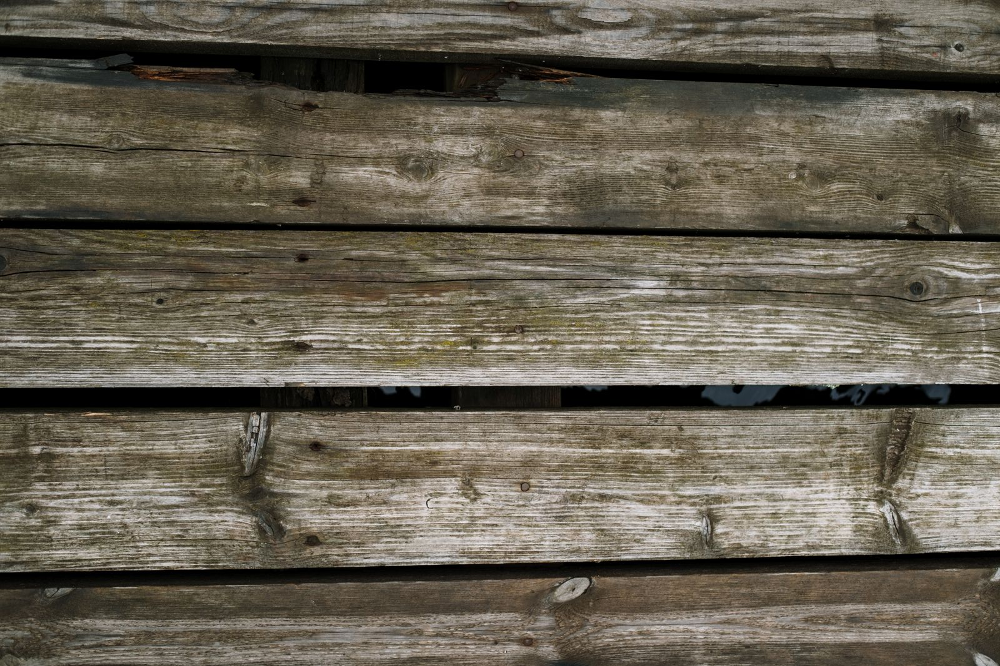
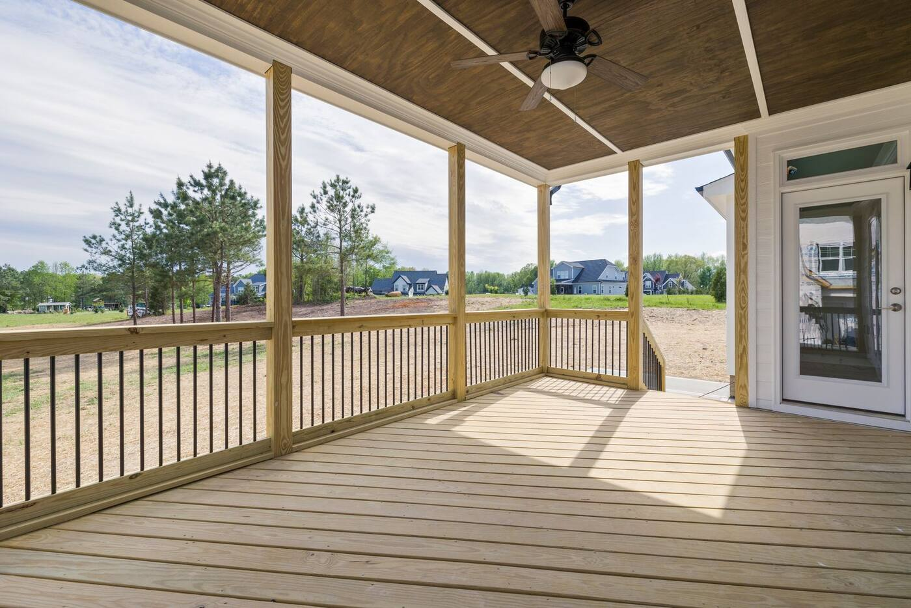

# American Restoration Tech — marketing website (draft)

A static marketing site for a general contracting business: services, an
interactive before-and-after gallery, credibility content and a contact form.

**Everything you see is real HTML/CSS/JS — no framework, no build step, no
dependencies.** Edit the files, refresh the browser, done.

---

## Preview it locally

Because the site loads its own font files, browsers block them when you open
`index.html` by double-clicking (a `file://` security rule). Run a tiny local
server instead:

```bash
cd camacho
python3 -m http.server 8000
```

Then open <http://localhost:8000>. Double-clicking `index.html` still works —
the site just falls back to system fonts, so don't judge the typography that way.

---

## Pages

| File | What it's for |
|---|---|
| `index.html` | Homepage — hero comparison, services, featured before/afters, stats, process, reviews |
| `services.html` | Eight services in detail, each with its own before/after and scope list |
| `projects.html` | Full gallery — 12 projects, filterable by service |
| `about.html` | Company story, differentiators, credentials, track record |
| `contact.html` | Contact details, estimate request form, FAQ |

---

## Replacing the placeholder photos

**This is the main thing to do.** The site is built photography-first: the hero,
the service tiles, the section bands and the page headers are all photographs.
Every one is currently a generated placeholder, and the layout will only look as
good as the photos you put in it.

### The shot list

| Where | Files | Crop | What to shoot |
|---|---|---|---|
| Homepage hero | `site/hero-bg.svg` | very wide, ~16:10 | Your best finished space or a crew shot. Needs room on the **right** — the left side sits under a dark scrim for the headline. |
| Featured comparison | `site/hero-before.svg`, `site/hero-after.svg` | 3:2 | Your single most dramatic transformation. |
| Service tiles (×8) | `site/tile-*.svg` | **portrait 4:5** | One strong image per service. Text sits over the bottom third, so keep that area simple. |
| Section bands | `site/band-process.svg`, `site/band-quote.svg`, `site/about-wide.svg` | wide, ~2:1 | Crew working, a finished interior, a job site. |
| Page headers | `site/head-services.svg`, `head-projects.svg`, `head-about.svg`, `head-contact.svg` | wide, ~2:1 | Anything representative — these sit under a heavy scrim. |
| Call-to-action | `site/cta-bg.svg` | wide, ~2.4:1 | A warm finished space. |
| About page | `site/about-team.svg` (4:3), `about-jobsite.svg` (4:5) | as noted | The actual team and an actual job site. |
| Projects (×12) | `projects/<slug>-before.svg` / `-after.svg` | 3:2 | Matched pairs — see below. |

To swap one in:

1. Save the real photo into the same folder, e.g.
   `assets/img/projects/cedar-deck-after.jpg`
2. Find that filename in the HTML (each appears once) and change the extension
   from `.svg` to `.jpg`.

That's it. The markup for a comparison is only four lines:

```html
<figure class="compare-block">
  <div class="compare" data-compare data-label="Two-level cedar deck">
    
    
  </div>
  <div class="compare-bar"><figcaption>Arlington, VA</figcaption></div>
</figure>
```

The slider, the labels, the drag handle and the slider/side-by-side toggle are
all built automatically by `assets/js/main.js`. You never write that markup.

### Getting before/after pairs that actually land

The comparison only works if the two photos line up. When shooting:

- **Same spot, same height, same lens.** Mark the floor with tape on day one.
  Take the "before" from the doorway and the "after" from the exact same tile.
- **Same framing.** If the before is landscape, the after must be landscape.
- **Similar light.** Same time of day, blinds in the same position. A dark
  before and a sunlit after reads as a lighting trick, not a renovation.
- **Shoot wide.** Images are cropped to 3:2 — leave room at the edges.
- **Export at 1600×1067 or larger**, quality ~80, as `.jpg` or `.webp`.
  Keep each file under ~400 KB so pages stay fast.

Ask the crew to take a "before" on every job before they touch anything. The
library builds itself over a year.

### Choosing photos that sit behind text

Several photos have headlines over them. Those use a *scrim* — a gradient that
darkens only the part of the image under the text, so the rest of the photo
still reads. Two things to know:

- **Real photos beat stock, every time.** A slightly imperfect shot of your own
  truck and crew converts better than a polished stock kitchen. Use your own work.
- **Busy is fine, bright-behind-the-text is not.** If a headline ever looks hard
  to read after you swap a photo in, either pick a frame with a darker or calmer
  left side, or deepen that section's scrim in `styles.css` (search for
  `__media::after`). The scrims here were checked against the rendered pixels and
  all text currently clears WCAG AAA — worth re-checking after you change photos.

### Adding a new project to the gallery

Copy any `<article class="project">` block in `projects.html`, paste it, and
change the image paths, title, blurb and location. The `data-category`
attribute controls which filter button shows it — use one of
`renovations`, `remediation`, `decks`, `landscaping`, `exteriors`.
Add `project--wide` to the class list to show one at full width.

## Content to replace before launch

Everything below is placeholder. Use find-and-replace across all `.html` files:

| Find | Replace with |
|---|---|
| `(555) 014-2300` | the real phone number (display format) |
| `+15550142300` | the real phone number (dialling format, no spaces) |
| `hello@americanrestorationtech.com` | the real email address |
| `1200 Placeholder Ave, Suite 4` | the real street address |
| `MHIC #000000` / `VA #0000000000` | the real licence numbers |
| `Placeholder Name` | real customer names on the reviews |
| `www.americanrestorationtech.com` | the real domain |

Also review by hand:

- **The three reviews** on the homepage — replace with real ones, with
  permission. Made-up testimonials are both illegal and easy to spot.
- **The statistics** (18+ years, 1,400+ projects, 4.9/5, 2-hour response) —
  make them true or remove them.
- **Certifications** (EPA Lead-Safe, IICRC, warranty length) — only claim what
  is currently held.
- **Service areas** in the homepage "Where we work" list.
- **The orange draft-notice box in the footer** — delete it. Search for
  `class="notice"` and remove that whole block from all five pages.
- **`sitemap.xml`** and the `<link rel="canonical">` tags — point them at the
  real domain.

---

## Wiring up the contact form

The form validates properly but doesn't send anywhere yet. It shows a demo
confirmation instead. To make it live, pick a form service —
[Formspree](https://formspree.io), [Netlify Forms](https://docs.netlify.com/forms/setup/)
and [Basin](https://usebasin.com) all have free tiers — and paste the endpoint
they give you into `contact.html`:

```html
<form class="form" data-contact-form data-endpoint="https://formspree.io/f/YOUR_ID" novalidate>
```

That's the only change needed. The JavaScript posts the form there and handles
the success and error states.

Until then, note the form says so honestly in its confirmation message — so
don't put the site live with the endpoint unset and assume leads are arriving.

---

## Deploying

The site is plain static files, so it will run anywhere:

- **Netlify** — drag the folder onto <https://app.netlify.com/drop>. Free,
  instant, gives you HTTPS and a URL you can share. Easiest option by far.
- **Vercel / Cloudflare Pages** — connect this repository, no build command,
  output directory is the repo root.
- **GitHub Pages** — Settings → Pages → deploy from branch.
- **Traditional hosting** — upload every file by FTP.

---

## How things are built

```
index.html, services.html, projects.html, about.html, contact.html
assets/
  css/styles.css     one stylesheet, organised in numbered sections
  js/main.js         nav, comparison sliders, filters, form, sticky call bar
  fonts/             Inter + Archivo, self-hosted (88 KB, no Google request)
  img/projects/      before/after pairs
  img/site/          hero, tiles, bands, page headers, logo, favicon, share image
tools/
  make-placeholders.py   regenerates every placeholder image
robots.txt, sitemap.xml
```

Notes for whoever maintains this:

- **The header and footer are copied into each page.** There's no templating,
  which is why the find-and-replace table above says "across all `.html` files."
  Five files is manageable; a static-site generator only pays off later.
- **Colours, spacing and fonts are CSS variables** at the top of `styles.css`
  under `:root`. Changing `--accent` re-themes the whole site.
- **It works without JavaScript.** Comparison sliders fall back to the two
  photos side by side, which is a perfectly good experience.
- **A sticky call bar** appears on phones once the hero scrolls away. A visible
  click-to-call is the single highest-impact conversion element on a contractor
  site, so think twice before removing it.
- **Accessibility**: the slider is a real `<input type="range">`, so it works
  with a keyboard and a screen reader. Keep the `alt` text descriptive when you
  swap photos in — "Before: water-stained ceiling in the front bedroom" beats
  "before photo".
- **SEO**: each page has its own title, description and canonical URL, and the
  homepage carries `LocalBusiness` structured data while `contact.html` carries
  FAQ structured data. Update the details in those `<script type="application/ld+json">`
  blocks when the real business information goes in.

Regenerate the placeholder images (if you add a project before you have photos):

```bash
python3 tools/make-placeholders.py
```

---

## Pre-launch checklist

- [ ] Real photos in, `alt` text written
- [ ] Phone, email, address, licence numbers replaced everywhere
- [ ] Real reviews with permission; statistics verified
- [ ] Form endpoint connected and tested end to end
- [ ] Draft-notice footer block deleted from all five pages
- [ ] Domain updated in canonical tags, `sitemap.xml` and `robots.txt`
- [ ] Checked on a real phone, not just a resized browser window
- [ ] Google Business Profile claimed and linked
